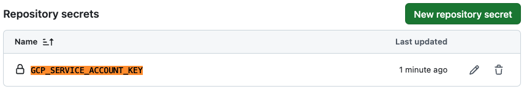

# 6-4. Deploy Keyper via GitHub Action

This tutorial will walk you through how to automate the creation of new roles and keys, and whole file encryption via [Keyper](https://jarrid.xyz/keyper) using [GitHub Actions](https://docs.github.com/en/actions).

[GitHub Actions](https://docs.github.com/en/actions) is a popular CI/CD automation tool. With the [Keyper GitHub Action](https://github.com/marketplace/actions/keyper-action) we've created, you can fully automate resource creation and whole file encryption with minimal configuration. Simply define your resources and encryption tasks using [Keyper Resource](https://jarrid.xyz/keyper/resource/) or JSON configuration files, and GitHub Actions will handle the deployment for you.

In this guide, we'll cover:

1. Setting up [Keyper GitHub Action](https://github.com/marketplace/actions/keyper-action) in your repository
2. Configuring the [Keyper GitHub Action](https://github.com/marketplace/actions/keyper-action)
3. Creating roles and keys via [Keyper Resource](https://jarrid.xyz/keyper/resource/)
4. Automating whole file encryption

Without further ado, let's get started!

## Steps

### Setting Up [Keyper GitHub Action](https://github.com/marketplace/actions/keyper-action) in Your Repository

Github actions are defined in the `.github/workflows` directory. Let's create a new directory and file for our Github action.

```sh {"cwd":"../../","id":"01J89JFBT83EN3MEZR8M5YCT0R"}
mkdir -p .github/workflows
```

Create a new github action file called `keyper-ci.yml`. This will trigger Keyper to create a plan both on merge and PR to the main branch.

```sh {"cwd":"../../","id":"01J8BNZXMK7R6QX1XSZJGBW294"}
tee .github/workflows/keyper-ci.yml <<EOF
name: Keyper Action (Deploy Plan)

on:
  push:
    branches: [main]
  pull_request:
    branches: [main]

jobs:
  keyper-action:
    runs-on: ubuntu-latest
    defaults:
      run:
        working-directory: ./6-use-cases/6-4-deploy-keyper-via-github-action/ # modify this
    steps:
      - uses: actions/checkout@v4
      - name: Run Keyper Action (Deploy Plan)
        id: keyper
        uses: jarrid-xyz/keyper@v0.0.4
        with:
          args: deploy plan
EOF
```

Create a new github action file called `keyper-cd.yml`. This will trigger Keyper to apply the plan when merging PR to the main branch.

```sh {"cwd":"../../","id":"01J8BNZXMK7R6QX1XSZNPXEH1B"}
tee .github/workflows/keyper-cd.yml <<EOF
name: Keyper Action (Deploy Apply)

on:
  push:
    branches: [main]

jobs:
  keyper-action:
    runs-on: ubuntu-latest
    defaults:
      run:
        working-directory: ./6-use-cases/6-4-deploy-keyper-via-github-action/ # modify this
    steps:
      - uses: actions/checkout@v4
      - name: Run Keyper Action (Deploy Plan)
        uses: jarrid-xyz/keyper@v0.0.4
        with:
          args: deploy apply
EOF
```

### Create Keyper Configuration

In order to use [Keyper](https://jarrid.xyz/keyper) GitHub Action, we need to first create [Keyper](https://jarrid.xyz/keyper) configuration. You can find more information on the [Keyper Configuration](https://jarrid.xyz/keyper/configuration/) page or Step 2([GCP](../../2-create-app-configuration-and-credentials-gcp/README.md), [AWS](../../2-create-app-configuration-and-credentials-aws/README.md)) of this tutorial.

#### GCP

To create a new role and key in a GCP project, let's create a new file called `app.local.yaml`:

```sh {"cwd":"../../","id":"01J8BZG51NVH7H0P1MF14QYAFP"}
tee app.local.yaml <<EOF
provider:
  tfcdk:
    stack: gcp
  gcp:
    accountId: <PROJECT_ID>
    region: us-east1
    credentials: /home/keyper/.cdktf-sa-key.json # Point to the GCP service account key JSON file
    backend:
      type: cloud
resource:
  backend:
    backend: local
    path: configs
out_dir: "/home/keyper"
EOF
```

Note that `.cdktf-sa-key.json` is a secret, we can use [GitHub's secrets](https://docs.github.com/en/actions/security-guides/encrypted-secrets) to store it. First, install [GitHub CLI](https://cli.github.com/):

```sh {"id":"01J8ECSXXH1TH043XEVTS4FZXA"}
# Add the repository
type -p curl >/dev/null || sudo apt install curl -y
curl -fsSL https://cli.github.com/packages/githubcli-archive-keyring.gpg | sudo dd of=/usr/share/keyrings/githubcli-archive-keyring.gpg
sudo chmod go+r /usr/share/keyrings/githubcli-archive-keyring.gpg
echo "deb [arch=$(dpkg --print-architecture) signed-by=/usr/share/keyrings/githubcli-archive-keyring.gpg] https://cli.github.com/packages stable main" | sudo tee /etc/apt/sources.list.d/github-cli.list > /dev/null

# Update and install gh
sudo apt update
sudo apt install gh -y
```

Next, we can login to GitHub and store the secret. If you followed the [Keyper Deployment Setup GCP](../../2-create-app-configuration-and-credentials-gcp/README.md) tutorial, you should have a `keyper/.cdktf-sa-key.json` file. Alternatively, you can create upload your own service account key JSON file.

```sh {"cwd":"../../","id":"01J8ECSXXH1TH043XEVYPTD0DR"}
gh auth login
gh secret set GCP_SERVICE_ACCOUNT_KEY -b"$(cat keyper/.cdktf-sa-key.json)" # Modify the file name to use your own key
```

After created, you should see `GCP_SERVICE_ACCOUNT_KEY` in your GitHub repository's secrets:



Add the following to [`.github/workflows/keyper-ci.yml`](./.github/workflows/keyper-ci.yml) and [`.github/workflows/keyper-cd.yml`](./.github/workflows/keyper-cd.yml):

```yml {"id":"01J8ECSXXH1TH043XEVZP2RBBR"}
      - name: Copy GCP Service Account Key
        run: echo "${{ secrets.GCP_SERVICE_ACCOUNT_KEY }}" > .cdktf-sa-key.json
```

### Creating Deployment,Roles and Keys via [Keyper Resource](https://jarrid.xyz/keyper/resource/)

Before we can run Keyper GitHub Action, we need to create a deployment, roles and keys. You can find more information on how to create a deployment, roles and keys in [Keyper Resource](https://jarrid.xyz/keyper/resource/) page or [Step 3](../../3-create-roles-and-keys/README.md) of this tutorial.

```sh {"cwd":"../../","id":"01J8ECSXXH1TH043XEW267NYZZ"}
export KEYPER_VERSION=[Enter Keyper Version]
docker run -it --rm --name keyper-cli \
    -v ./configs:/home/keyper/configs \
    -v ./app.local.yaml:/home/keyper/app.local.yaml \
    ghcr.io/jarrid-xyz/keyper:${KEYPER_VERSION} \
    resource create -t deployment
```

#### Push to Github

Now, let's add the `app.local.yaml` and `configs` directory to our repository so that `keyper-ci.yml` and `keyper-cd.yml` can use them.

```sh {"cwd":"../../"}
git add app.local.yaml configs
git commit -m "Add Keyper configuration"
git push
```

### Automating Whole File Encryption

➡️ [Back to Use Cases](../README.md)