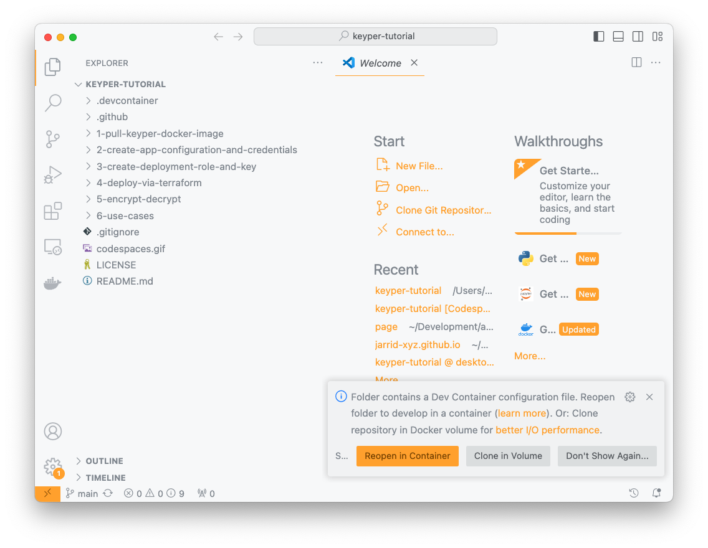

# Keyper Tutorial

👋 Welcome to the [Keyper](https://jarrid.xyz/keyper/) tutorial!

This is a self-paced tutorial walking you through how to use [Keyper](https://jarrid.xyz/keyper/) to handle some of the most common tasks in data security and encryption such as whole file encryption or data value encryption. The tutorial is fully set up in [Visual Studio Code Dev Containers](https://code.visualstudio.com/docs/devcontainers/containers) and we've already installed all the required dependency for you. That said, you can also clone the [keyper-tutorial](https://github.com/jarrid-xyz/keyper-tutorial) and run it locally.

## Introduction

[Keyper](https://jarrid.xyz/keyper) by [Jarrid](https://jarrid.xyz) is a suite of crypto key management APIs designed to simplify key creation, management, deployment, and encryption/decryption in a standardized and secure way. Operations are file-based and can be easily automated, tracked, audited, and managed via file-based processes such as GitOps. Fully integrated with cloud KMS services such as AWS KMS or GCP KMS, Keyper leverages managed crypto key generation and reduces the infrastructure maintenance burden.

## Questions and Feedback

Throughout the tutorial, if you have any questions, here are a couple places you can reach out for help:

- [Reach out to us at Jarrid.](https://jarrid.xyz/#contact)
- [Ask questions on our discussion board.](https://github.com/orgs/jarrid-xyz/discussions)

If you have any feedback throughout the tutorial or at the end, we'd also very appreciate it if you could spend 30 seconds [taking a short survey to help us improve.](https://tally.so/r/wMLEA8)

## Getting Started

There are two ways to run this tutorial. This repo is set up to be run in [Visual Studio Code Dev Containers](https://code.visualstudio.com/docs/devcontainers/containers) with the [Runme](https://runme.dev/) extension.

Run this in vscode with our templated devcontainer configuration. [Runme extensions](https://runme.dev/) and [Terraform](https://www.terraform.io/) will be pre-installed. You can do so by
  
```
git clone git@github.com:jarrid-xyz/keyper-tutorial.git
code keyper-tutorial
```

You will be prompted to open the folder in devcontainer, make sure you select `Reopen in Container`.




Alternatively, you can clone this repository and [install the Runme extension](https://docs.runme.dev/installation/installrunme) separately. Note that this might require you to install additional dependencies if you don't already have them installed on your local environment.

Without further ado, let's get started with the first step: ➡️ [Pulling the Keyper Docker Image](1-pull-keyper-docker-image/README.md)

## Table of Contents

- [Keyper Tutorial](#keyper-tutorial)
  - [Introduction](#introduction)
  - [Questions and Feedback](#questions-and-feedback)
  - [Getting Started](#getting-started)
  - [Table of Contents](#table-of-contents)
  - [Data Security and Encryption Use Cases](#data-security-and-encryption-use-cases)
    - [Whole File Encryption on Cloud Storage](#whole-file-encryption-on-cloud-storage)
    - [Sensitive Data Value Encryption](#sensitive-data-value-encryption)
    - [Encryption Key and Access Management](#encryption-key-and-access-management)
  - [Tutorial](#tutorial)
    - [1. Pull Keyper Docker Image](#1-pull-keyper-docker-image)
    - [2. Create App Configuration And Credentials](#2-create-app-configuration-and-credentials)
    - [3. Create Deployment, Role and Key](#3-create-deployment-role-and-key)
    - [4. Deploy via Terraform](#4-deploy-via-terraform)
    - [5. Encrypt/Decrypt](#5-encryptdecrypt)
    - [6. Use Cases](#6-use-cases)

## Data Security and Encryption Use Cases

Here are some practical data security and encryption use cases we will cover in this tutorial, showcasing how simple it is to implement them with [Keyper](https://jarrid.xyz/keyper).

### Whole File Encryption on Cloud Storage

This tutorial will show you how to tackle data vulnerabilities identified by popular cloud security platforms like Dig or Wiz. [Bonus] Take one step further to automate this operation within your existing tech stack.

### Sensitive Data Value Encryption

Encrypt individual data values to protect sensitive information. This is useful for publishing records with encrypted fields (e.g., via Kafka) or encrypting raw values before database insertion. This tutorial will share a few examples of how [Keyper](https://jarrid.xyz/keyper) can be integrated with data handling clients to perform schema-aware encryption and decryption for single data values.

### Encryption Key and Access Management

This tutorial will show you how to use encryption keys to simplify access control across data platforms and infrastructure by integrating with IAM roles and permissions, instead of creating row/column-level permissions for each data store or platform individually.

## Tutorial

The tutorial is organized into several directories, each containing a README.md file with example commands and explanations. Commands are executable on [CodeSandbox](https://codesandbox.io/p/devbox/competent-keller-z73fkv), where we've already pre-configured the environment for you.

### 1. Pull Keyper Docker Image

Set up the Docker environment to get started with [Keyper](https://jarrid.xyz/keyper).

➡️ [Go to Tutorial](1-pull-keyper-docker-image/README.md)

### 2. Create App Configuration And Credentials

Create the necessary application configuration and credentials for [Keyper](https://jarrid.xyz/keyper).

➡️ [Go to Tutorial](2-create-app-configuration-and-credentials/README.md)

### 3. Create Deployment, Role and Key

Create the deployment, role, and encryption key, and use [Keyper](https://jarrid.xyz/keyper) to manage these resources.

➡️ [Go to Tutorial](3-create-deployment-role-and-key/README.md)

### 4. Deploy via Terraform

Deploy the infrastructure using [Terraform](https://developer.hashicorp.com/terraform). [Bonus] You can easily integrate [Terraform](https://developer.hashicorp.com/terraform) into your existing CI/CD process.

➡️ [Go to Tutorial](4-deploy-via-terraform/README.md)

### 5. Encrypt/Decrypt

Perform encryption and decryption operations with [Keyper](https://jarrid.xyz/keyper) to secure sensitive information.

➡️ [Go to Tutorial](5-encrypt-decrypt/README.md)

### 6. Use Cases

Combine steps 1-5, we'll show you how you can handle some of the most common data security and encryption use cases with [Keyper](https://jarrid.xyz/keyper):

- **Whole File Encryption on Cloud Storage**: ➡️ [Go to Tutorial](6-use-cases/6-1-whole-file-encryption-on-cloud-storage/README.md)
- **Sensitive Data Value Encryption**: ➡️ [Go to Tutorial](6-use-cases/6-2-sensitive-data-value-encryption/README.md)
- **Encryption Key and Access Management**: ➡️ [Go to Tutorial](6-use-cases/6-3-encryption-key-and-access-management/README.md)
